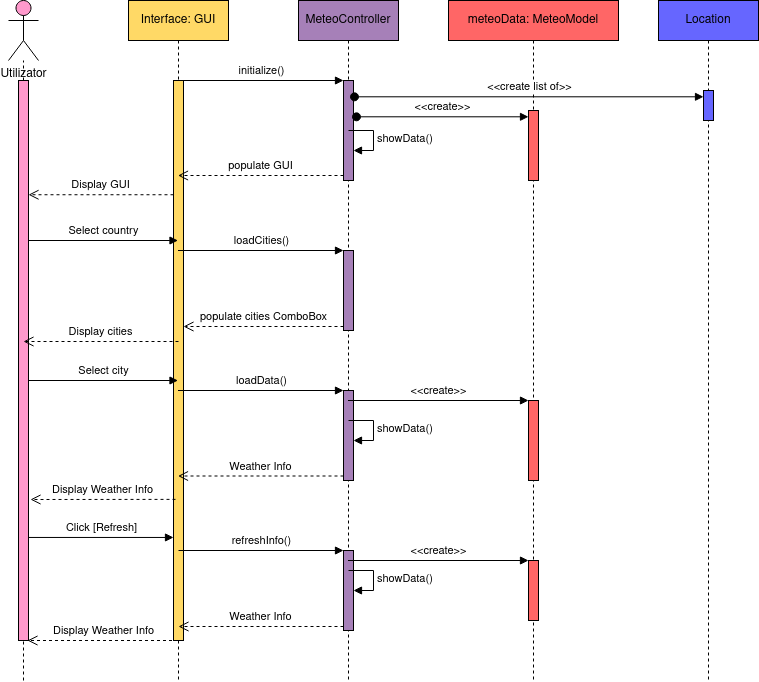

# MeteoApp
<br>

## Table of Contents
- [Descriere](#descriere)
- [Utilizare](#utilizare)
- [Diagrama de Clase](#diagrama-de-clase)
- [Diagrama de Secventa](#diagrama-de-secventa)  
- [Realizator](#realizator)

## Descriere
Repository-ul contine o aplicate Java ce ofera informatii despre vreme. Pornind de la un fisier cu date despre diferite
localitati, aplicatia incarca datele, si face request-uri catre API-ul de la [OpenWeather](openweather.org) pentru a
incarca informatiile ce se doresc a fi afisate. Aplicatia foloseste [JavaFX](https://openjfx.io/) si [GSON](https://github.com/google/gson).


## Utilizare

Informatiile despre localitati trebuie sa se gaseasca in fisierul **_src/main/resources/inputFile.txt_** si fiecare linie
trebuie sa fie de forma:

[**ID**] [**Nume_Oras**] [**Latitudine**] [**Longitudine**] [**Codul ISO al Tarii**]

Campurile trebuie sa fie separate prin **Tab**.

Aplicatia se poate rula direct din linie de comanda, sau se poate fabrica un JAR pentru executia mai rapida, si mai
usoara.

### Exemplu fisier de intrare

```
ID	nm		lat		lon		countryCode
819827	Razvilka	55.591667	37.740833	RU
524901	Moscow		55.752220	37.615555	RU
2973393	Tarascon	43.805828	4.660280	FR
2986678	Ploufragan	48.491409	-2.794580	FR
666767	Slatina		44.4333		24.3667		RO
683506	Bucharest	44.4323		26.1063		RO
2643743	London		51.5085		-0.1257		GB
2643123	Manchester	53.4809		-2.2374		GB
3169070	Rome		41.8947		12.4839		IT
3173435	Milan		45.4643		9.1895		IT
3117735	Madrid		40.4165		-3.7026		ES
3128760	Barcelona	41.3888		2.159		ES
2950159	Berlin		52.5244		13.4105		DE
2867714	Munich		48.1374		11.5755		DE
2761369	Vienna		48.2085		48.2085		AT
2766824	Salzburg	47.7994		13.044		AT
2657896	Zurich		47.3667		8.55		CH
2660646	Geneva		46.2022		6.1457		CH
756135	Warsaw		52.2298		21.0118		PL
3094802	Krakow		50.0833		19.9167		PL
```

## Diagrama de clase


## Diagrama de secventa



## Realizator

:man_student: Tudose F.-D. Alin-Romeo