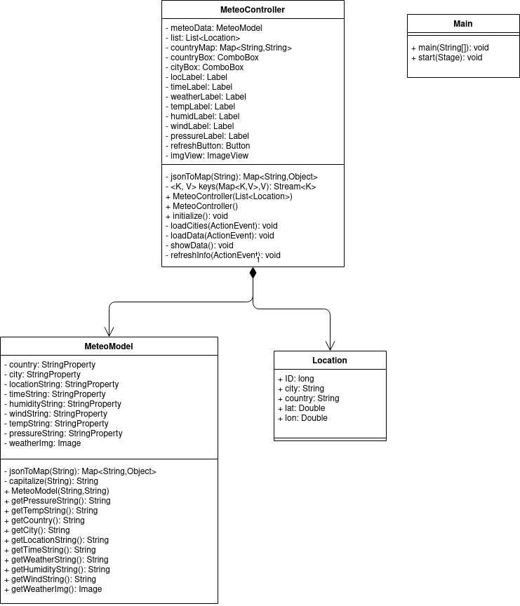

# MeteoApp
 

## Table of Contents
- [Descriere](#descriere)
- [Utilizare](#utilizare)
- [Realizator](#realizator)

## Descriere
Repository-ul contine o aplicate Java ce ofera informatii despre vreme. Pornind de la un fisier cu date despre diferite
localitati, aplicatia incarca datele, si face request-uri catre API-ul de la [OpenWeather](openweather.org) pentru a
incarca informatiile ce se doresc a fi afisate. Aplicatia foloseste [JavaFX](https://openjfx.io/) si [GSON](https://github.com/google/gson).

## Utilizare

Informatiile despre localitati trebuie sa se gaseasca in fisierul **_src/main/resources/inputFile.txt_** si fiecare linie
trebuie sa fie de forma:

[**ID**] [**Nume_Oras**] [**Latitudine**] [**Longitudine**] [**Codul ISO al Tarii**]

Campurile trebuie sa fie separate prin **Tab**.

Aplicatia se poate rula direct din linie de comanda, sau se poate fabrica un JAR pentru executia mai rapida, si mai
usoara.

## Diagrama de clase

## Realizator

:man_student: Tudose F.-D. Alin-Romeo